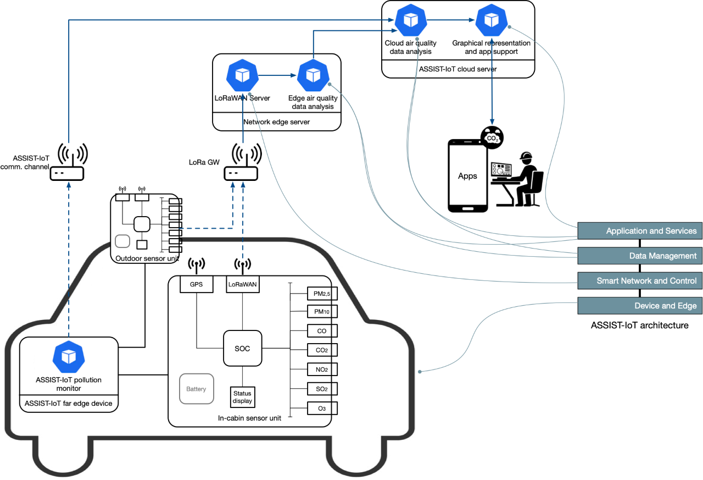

 

The BREATHE project proposes an in-cabin and outdoor air pollution monitoring system to assure healthy conditions when traveling, driving and operating vehicles, and to analyse the evolution of environmental parameters in cities. An on-board hardware solution will be developed using a system on chip (SOC) platform provided with sensors for particle matter (PMx), CO, CO2, NO2, SO2, O3 and climatic conditions. This integral air-quality measurement equipment will be interconnected with the on-board ASSIST-IoT node, complementing the current emission monitoring system. Additionally, a Low-Power Wide Area Network (LP-WAN) will be deployed within the ASSIST-IoT ecosystem, to allow air quality monitoring in cities using a long-range communication technology for IoT with real network edge potential for task offloading. Data collected will be firstly pre-processed in the on-board unit (initial data treatment at the SOC and later in the ASSIST-IoT node, if applicable), and then intelligent analysis of data will be offloaded to an edge plane at the edge of the wired network. While in-cabin air quality estimations will be ready at this stage, the final global assessment of outdoor air quality per geographical areas will be carried out in a far cloud.

